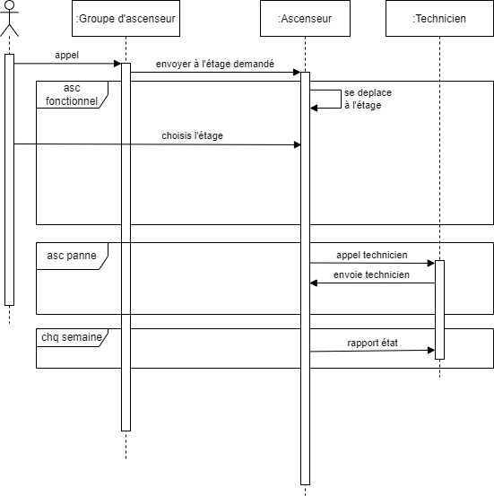
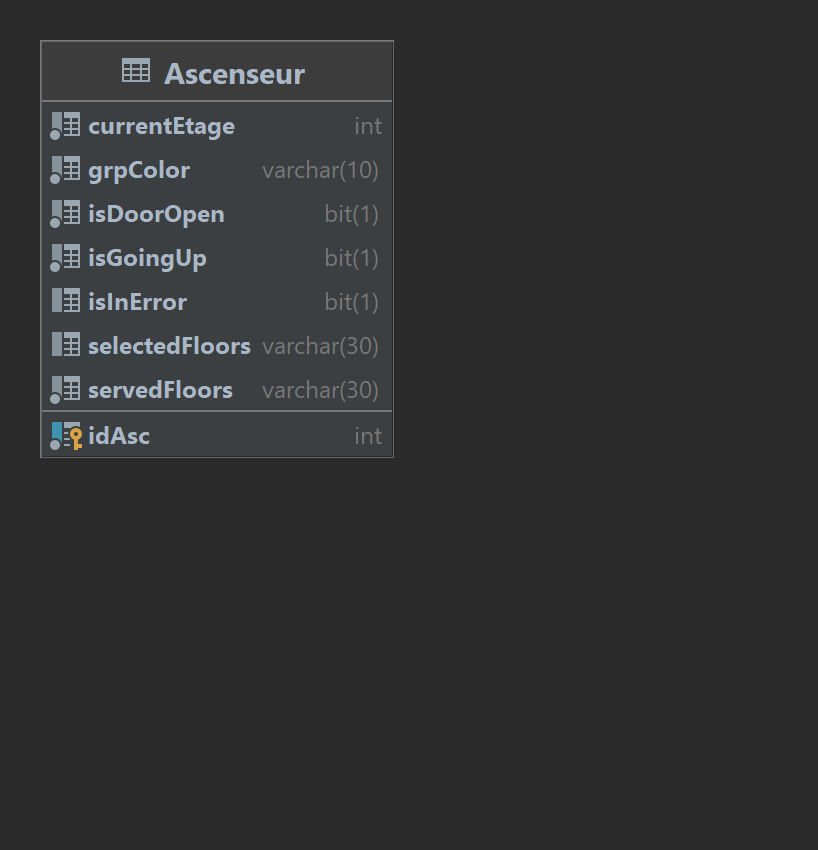

## Objectifs du système à modéliser

On propose de modéliser un système d'ascenseurs.

Un usager fait appel à un groupe d'ascenseur.
Ce groupe d'ascenseur communique avec les ascenseurs afin de déterminer lequel sera dirigé vers l'usager.
Enfin, les ascenseurs envoie des messages aux techniciens lorsque l'un des ascenseurs appelé est hors service.

Le groupe d'ascenseur demande aupres de tous les ascenseurs un ascenseur basé sur le sens, l'appartenance aux groupes, l'etat de l'ascenseur, les étages desservis.
Ensuite, une fois l'ascenseur selectionné, il est possible de sélectionner l'étage auquel nous souhaitons nous rendre et qui est desservis par l'ascenseur.

Ascenseur -> REST & JMS
Grp-Ascenseur -> Rest Client
Technicien -> JMS

## Schéma relationnel

## Exigences fonctionnelles

* lors d'un appel à un groupe d'ascenseur, on doit avoir au moins un ascenseur opérationel
* l'usager doit pouvoir connaitre les étages desservis
* l'usager doit connaitre les etages déjà selectionné 
* l'ascenseur doit envoyer un message au technicien lorsque son etat est HS
* l'ascenseur prévient l'usager lorsqu'il est HS
* l'ascenseur envoie un rapport d'etat des ascenseurs chaque mois

## Exigences non fonctionnelles

* On utilise du messaging pour la communication entre l'ascenseur et le Technicien, comme c'est un acteur externe et que le message doit etre transmis de manière fiable
